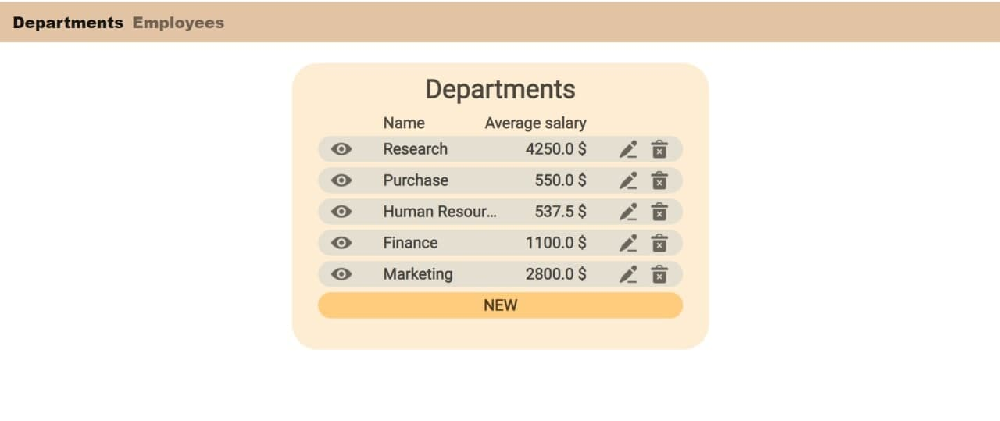
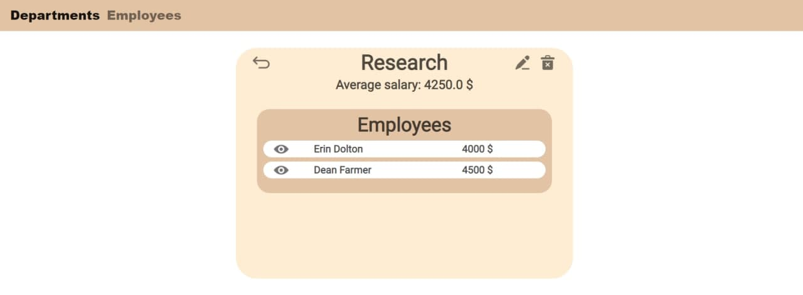
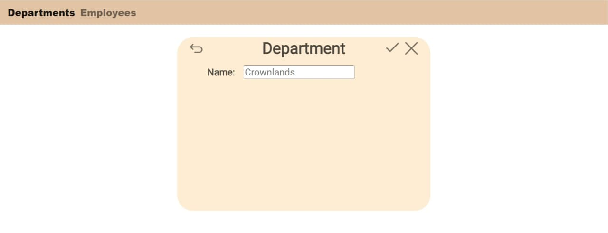
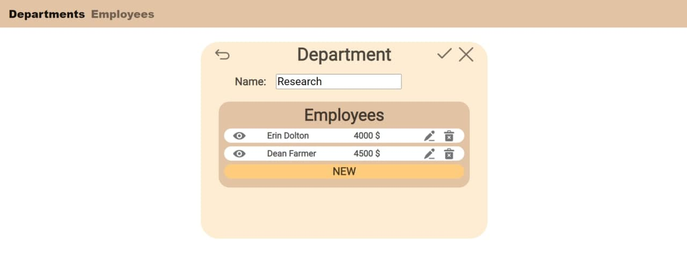
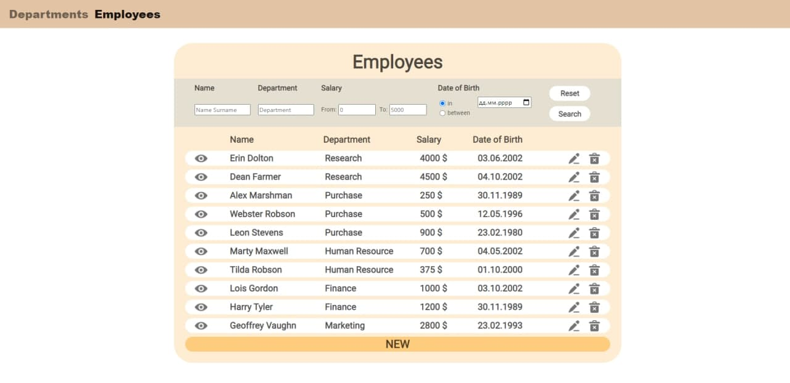
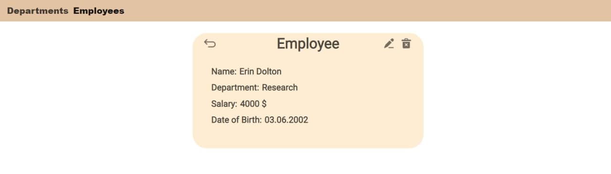
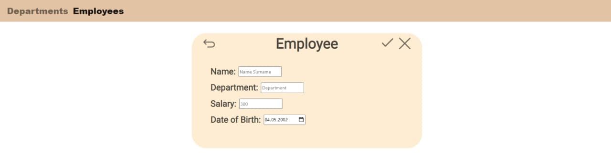
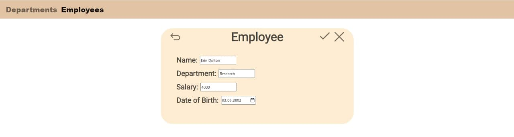

# Department App 

### Vision

Department App is a web application which allows users to record information about departments and employees.

Application should provide:

- Storing departments and employees in database
- Display list of departments
- Managing the list of departments (adding, editing, removing)
- Display list of employees
- Managing the list of employees (adding, editing, removing)
- Searching employees by name, department, date of birth
- Searching employees with salary in specified range
- Searching employees born in specified period

### 1. Departments

#### 1.1 Display list of departments

The mode is designed for viewing the list of departments.

***Main scenario:***

- User selects *"Departments"* at navigation bar
- Application displays list of departments (Pic. 1.1)

Pic. 1.1 List of departments

The list displays the following columns:

- Name - name of the department
- Average salary - average salary across all the employees that works in the department

#### 1.2 Display department

The mode is designed for viewing the list of departments.

***Main scenario:***

- User clicks the *"Show"* button in the departments list view mode
- Application redirects user to the department page

***Cancel operation scenario:***

- User clicks the *"Show"* button in the departments list view mode
- Application redirects user to the department page
- User presses the *"Return"* button
- List of departments is displaying to user.

Pic. 1.2 Department

The page displays the following:

- Name - name of the department
- Average salary - average salary across all the employees that works in the department
- List of employees that works in the department
    - Name - name of the employee
    - Salary - salary of the employee

#### 1.3 Add department

***Main scenario:***

- User clicks the *"NEW"* button in the departments list view mode
- Application redirects user to the department creation page
- User enters data and presses the *"Submit"* button
- If entered data is valid, the record is added to the database and message indicating success is displayed
- If error occurs, then error message is displayed

***Cancel operation scenario:***

- User clicks the *"NEW"* button in the departments list view mode
- Application redirects user to the department creation page
- User enters data and presses the *"Cancel"* or *"Return"* button
- Data don’t save in database, then list of departments is displaying to user.

Pic. 1.3 Adding a department

When adding a department the following details are entered:

- Department name - name of the department

Constraints for data validation:

- Department name must be unique and be from 3 up to 100 symbols

#### 1.4 Edit department

***Main scenario:***

- User clicks the *"Edit"* button in the departments list view mode
- Application redirects user to the department management page
- User enters data and presses the *"Submit"* button
- If entered data is valid, the corresponding record is updated in the database and message indicating success is
  displayed
- If error occurs, then error message is displayed

***Cancel operation scenario:***

- User clicks the *"Edit"* button in the departments list view mode
- Application redirects user to the department management page
- User enters data and presses the *"Cancel"* or *"Return"* button
- Data don’t save in database, then department is displaying to user.

Pic. 1.4 Editing a department

When editing a department the following details are entered:

- Department name - name of the department

Constraints for data validation:

- Department name must be unique and be from 3 up to 100 symbols

#### 1.5 Delete department

***Main scenario:***

- User clicks the *"Delete"* button in the departments list view mode
- If chosen department is in the database, the corresponding record is deleted from the database and message indicating
  success is displayed
- If error occurs, then error message is displayed
- List of departments is displaying to user.

### 2. Employees

#### 2.1 Display list of employees

The mode is designed for viewing the list of employees.

***Main scenario:***

- User selects *"Employees"* at navigation bar
- Application displays list of employees (Pic. 2.1)

Pic. 2.1 List of employees

The list displays the following columns:

- Employee - employee's name
- Department - name of the department the employee works in
- Salary - employee's salary
- Date of birth - employee's date of birth

***Filtering:***

- User enters search data and clicks on the *"Search"* button
- Application displays updated list of employees based on provided data

#### 2.2 Display employee

The mode is designed for viewing the list of employees.

***Main scenario:***

- User clicks the *"Show"* button in the employees list view mode
- Application redirects user to the employee page

***Cancel operation scenario:***

- User clicks the *"Show"* button in the employees list view mode
- Application redirects user to the employee page
- User presses the *"Return"* button
- List of employees is displaying to user.

Pic. 2.2 Employee

The page displays the following:

- Employee - employee's name
- Department - name of the department the employee works in
- Salary - employee's salary
- Date of birth - employee's date of birth

#### 2.3 Add employee

***Main scenario:***

- User clicks the *"NEW"* button in the employees list view mode
- Application redirects user to the employee creation page
- User enters data and presses the *"Submit"* button
- If entered data is valid, the record is added to the database and message indicating success is displayed
- If error occurs, then error message is displayed

***Cancel operation scenario:***

- User clicks the *"NEW"* button in the employees list view mode
- Application redirects user to the department creation page
- User enters data and presses the *"Cancel"* or *"Return"* button
- Data don’t save in database, then list of employees is displaying to user.

Pic. 2.3 Adding an employee

When adding an employee the following details are entered:

- Name - employee's name
- Department - employee's department
- Salary - employee's salary
- Date of Birth - employee's date of birth

Constraints for data validation:

- Department with given name must exist

#### 2.4 Edit employee

***Main scenario:***

- User clicks the *"Edit"* button in the employees list view mode
- Application redirects user to the employee management page
- User enters data, chooses new department for the employee and presses the *"Submit"* button
- If entered data is valid, the corresponding record is updated in the database and message indicating success is
  displayed
- If error occurs, then error message is displayed

***Cancel operation scenario:***

- User clicks the *"Edit"* button in the employees list view mode
- Application redirects user to the employee management page
- User enters data and presses the *"Cancel"* or *"Return"* button
- Data don’t save in database, then list of employees is displaying to user.

Pic. 2.4 Editing an employee

When editing an employee the following details are entered:

- Name - employee's name
- Department - employee's department
- Salary - employee's salary
- Date of Birth - employee's date of birth

Constraints for data validation:

- Department with given name must exist

#### 2.5 Delete employee

***Main scenario:***

- User clicks the *"Delete"* button in the employees list view mode
- If chosen employee is in the database, the corresponding record is deleted from the database and message indicating
  success is displayed
- If error occurs, then error message is displayed
- List of employees is displaying to user.